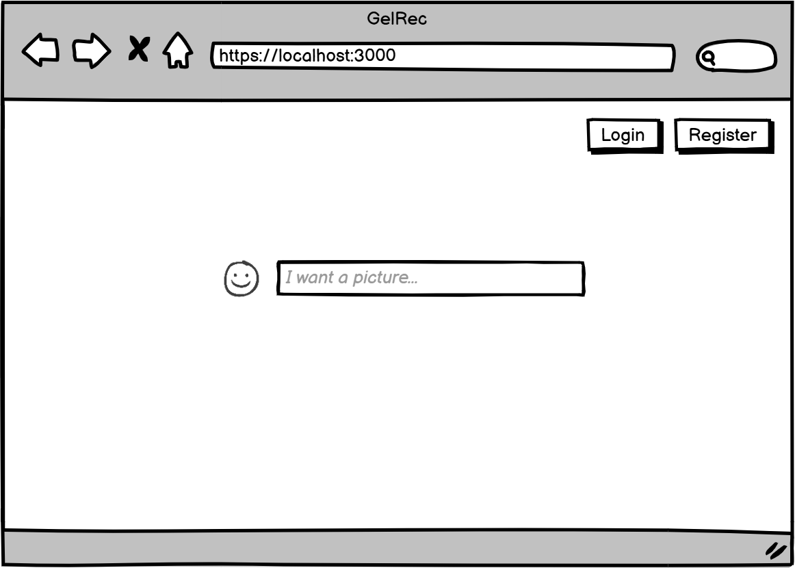
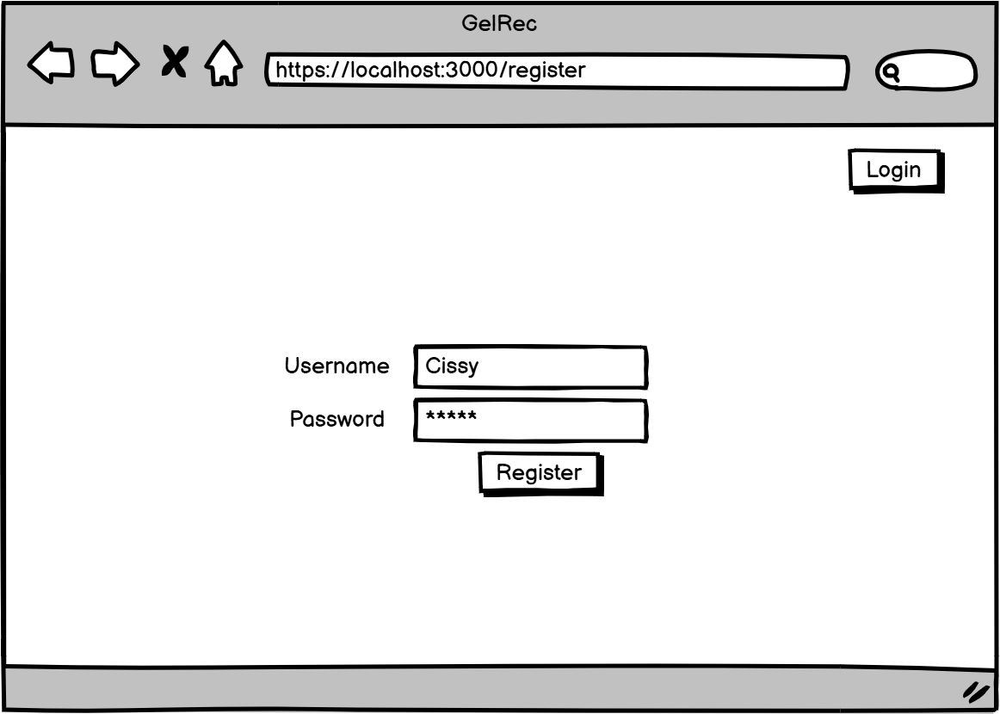
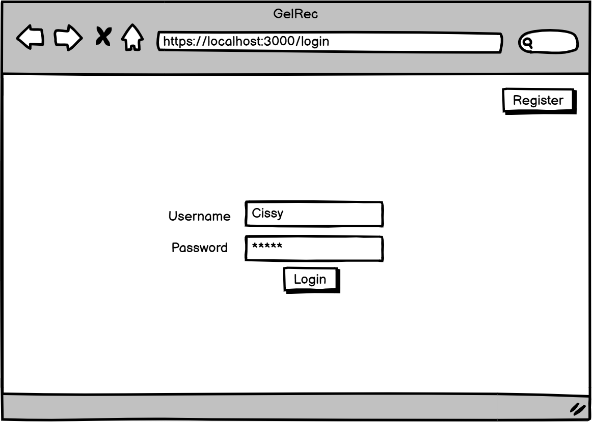
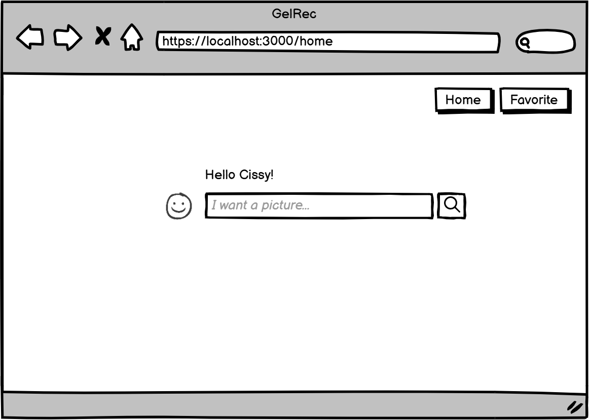
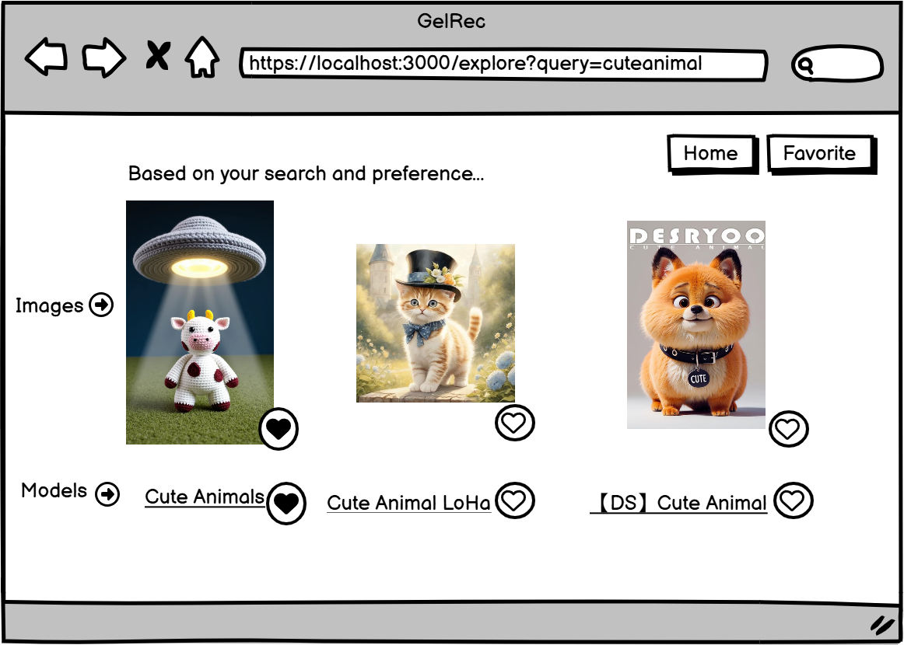
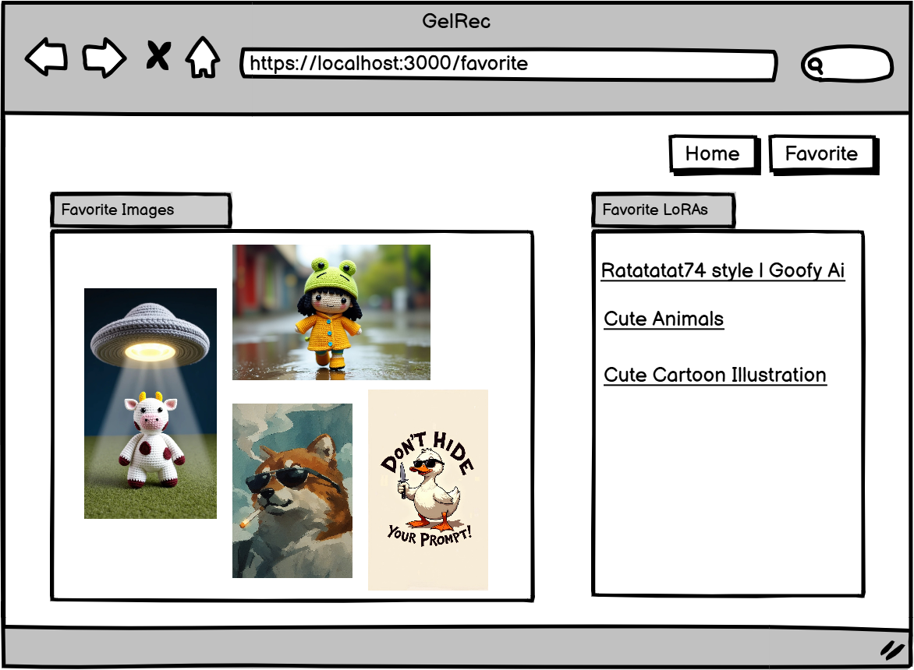
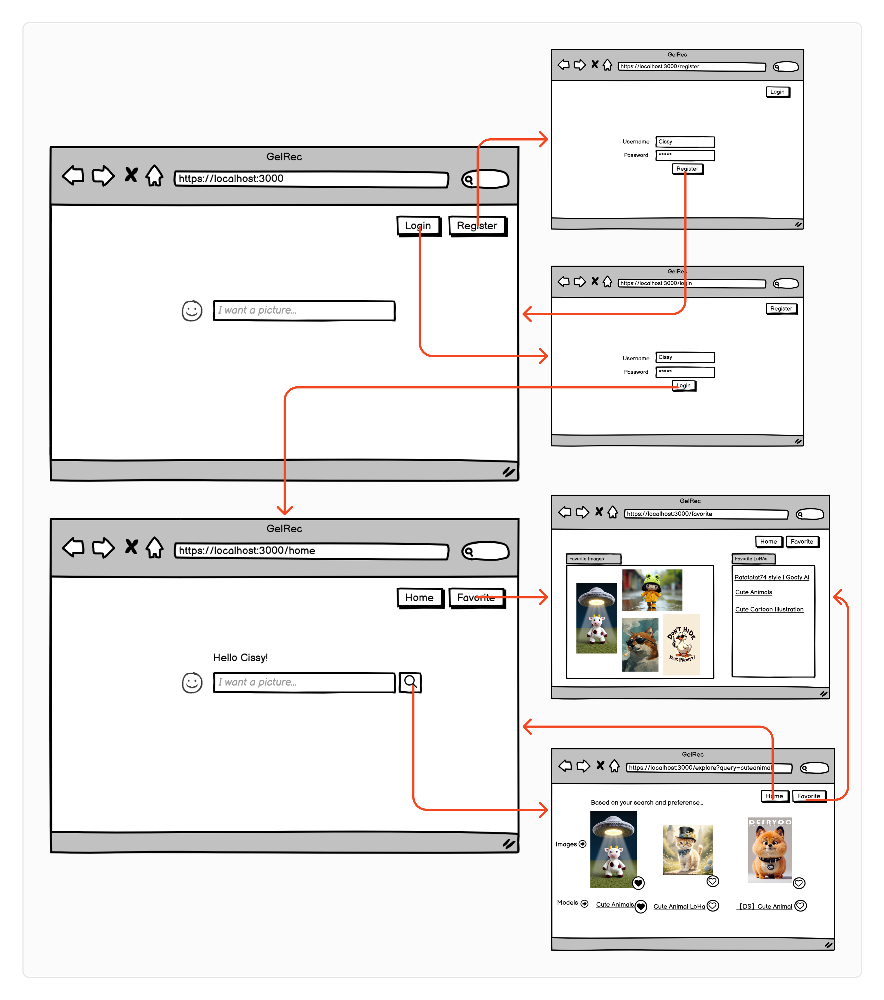

# Image Recommendation System 

## Overview

With the rise of AI-generated art, platforms like Civitai have become go-to sources for unique, artist-created images and models. This project uses data scraped from Civitai to make it easy to explore and discover both images and LoRA models through a simple input field where you can describe what you’re looking for. The app learns your preferences over time to recommend images and LoRA models that align with your interests.

Whether you're seeking specific styles or new creative inspiration, this tool provides a seamless way to browse AI-generated art and compatible models side by side, helping you uncover the perfect visuals and tools for your projects.

## Data Model

The application will store Users, Images, LoRA Models

* users can have multiple preference images (via references)
* each image can have one/multiple lora models (by references)

An Example User:

```javascript
{
  username: "user1",
  hash: // a password hash,
  preference: // a list of tags or embeddings 
  recommeded_images: //reference to image documents
}
```

An Example List with Image:

```javascript
{
  url: // a url link to where the image is stored (aws S3)
  tags://image tag
  embedding: //image embedding
  createdBy: // author of the image,
  lora: //reference to lora model used
  //other image metadata
}
```

An Example List with Lora model:

```javascript
{
  url: // url to where the lora model is stored
  createdBy: // creator of the model
  //other model metadata 
}
```


## [Link to Commented First Draft Schema](src/db.mjs) 

## Wireframes

/ - root page



/register - page for user register 



/login - page for login



/home - homepage



/explore - image/model recommendation based on user preference and input



/favorite - user favoratire lists




## Site map



## User Stories / Use Cases

1. **As a non-registered user**, I can register a new account with the site.
2. **As a user**, I can log in to the site.
3. **As a user**, I can enter a description or keywords in an input field to search for images that match my interests.
4. **As a user**, I can view personalized image recommendations based on my previous interactions and preferences.
5. **As a user**, I can save images I like to my favorites list for future reference.
6. **As a user**, I can view all saved images in a single list or collection.
7. **As a user**, I can view recommended LoRA models based on the images and styles I interact with.
8. **As a user**, I can save LoRA models I like to my collection for easy access.
9. **As a user**, I can view my profile, including my saved images and LoRA models, as well as update my preferences.
10. **As a user**, I can log out of the site securely.

## Research Topics
* (6 points) Use React as front-end framework for real-time recommendation
* (1 - 6 points) Use a server-side JavaScript library or module
    * planning to use similarity module as the backend recommendation algorithm

## [Link to Initial Main Project File](src/app.mjs) 

## Annotations / References Used

1. [passport.js authentication docs](http://passportjs.org/docs)
2. [tutorial on vue.js](https://vuejs.org/v2/guide/) 
3. https://medium.com/@ManishChablani/getting-started-with-image-recommendation-a-simplified-approach-to-zero-shot-semantic-similarity-b64534e3107f
4. https://www.mongodb.com/docs/atlas/atlas-vector-search/vector-search-type/

